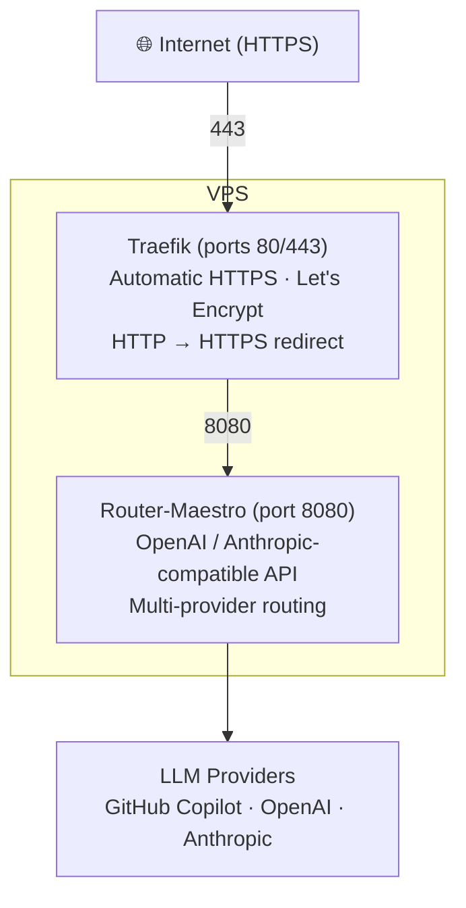

# Router-Maestro

[](https://github.com/MadSkittles/Router-Maestro/actions/workflows/ci.yml)
[](https://github.com/MadSkittles/Router-Maestro/actions/workflows/release.yml)

Router-Maestro is a local or self-hosted proxy that lets OpenAI-, Anthropic-, and Gemini-compatible clients use models from GitHub Copilot, OpenAI, Anthropic, and custom providers — with priority-based selection and automatic fallback.

## TL;DR

**Use GitHub Copilot's models (Claude, GPT-4o, o3-mini) with Claude Code or any OpenAI/Anthropic-compatible client.**

Router-Maestro acts as a proxy that gives you access to models from multiple providers through a unified API. Authenticate once with GitHub Copilot, and use its models anywhere that supports OpenAI or Anthropic APIs.

## Features

### Core

- **Multi-provider support**: GitHub Copilot (OAuth), OpenAI, Anthropic, and custom OpenAI-compatible endpoints
- **Dual API compatibility**: Both OpenAI (`/api/openai/v1/...`) and Anthropic (`/v1/messages`) API formats
- **Gemini API compatibility**: Gemini REST API format (`/api/gemini/v1beta/...`) for Gemini CLI/SDK
- **Cross-provider translation**: Seamlessly route OpenAI requests to Anthropic providers and vice versa
- **Intelligent routing**: Priority-based model selection with automatic fallback on failure
- **Fuzzy model matching**: No need to type exact model IDs. Subagents, agent teams, and tools that hardcode model names (e.g. `opus-4-6`, `claude-sonnet-4.5`) are resolved automatically to the correct provider model
- **CLI management**: Full command-line interface for configuration and server control
- **Docker ready**: Production-ready Docker images with Traefik integration
- **Configuration hot-reload**: Auto-reload config files every 5 minutes without server restart

### Advanced

- **1M context support**: Activate Opus 4.6, Opus 4.7, Opus 4.8, *or* Sonnet 4.6 with a 1M context window via GitHub Copilot — just select `claude-opus-4-6[1m]`, `claude-opus-4-7[1m]`, `claude-opus-4-8[1m]`, or `claude-sonnet-4-6[1m]` during `config claude-code` setup. For 4.6 / 4.7 the `[1m]` beta header is auto-mapped to a dedicated Copilot variant (`claude-opus-4.6-1m` / `claude-opus-4.7-1m-internal`); for 4.8 and Sonnet 4.6 the base catalog entry already advertises 1M, so the synthetic `[1m]` key just raises Claude Code's auto-compact threshold (`CLAUDE_CODE_AUTO_COMPACT_WINDOW`) to 1M.
- **Transparent reasoning-tier routing**: Requests for `claude-opus-4.7` with `reasoning_effort: "high"` or `"xhigh"` (or an Anthropic-style `thinking.budget_tokens` ≥ 8192) are auto-rewritten to the dedicated Copilot variants `claude-opus-4.7-high` / `claude-opus-4.7-xhigh` — no client changes needed. The newly-opened `reasoning_effort: "max"` tier (Opus 4.6 / 4.7 / 4.8 on Copilot) is also passed through verbatim when the model catalog advertises it.

## Table of Contents

- [Quick Start](#quick-start)
- [Core Concepts](#core-concepts)
  - [Model Identification](#model-identification)
  - [Auto-Routing](#auto-routing)
  - [Priority & Fallback](#priority--fallback)
  - [Cross-Provider Translation](#cross-provider-translation)
  - [Contexts](#contexts)
- [CLI Reference](#cli-reference)
- [API Reference](#api-reference)
- [Configuration](#configuration)
  - [Metrics & Observability](#metrics--observability)
- [Deployment](#deployment)
  - [Architecture](#architecture)
  - [Server and Client API Keys](#server-and-client-api-keys)
  - [Local with pip install](#local-with-pip-install)
  - [Option A: Remote Docker (No HTTPS)](#option-a-remote-docker-no-https)
  - [Option B: Production (Docker Compose + Traefik + HTTPS)](#option-b-production-docker-compose--traefik--https)
  - [Remote Management](#remote-management)
  - [Advanced Configuration](#advanced-configuration)
- [License](#license)
- [Changelog](#changelog)

## Quick Start

Get a local server running in 3 steps. The server (started locally or via Docker with `~/.config/router-maestro` mounted) auto-creates a `local` context with a generated API key — no manual `context add` is needed when client and server are on the same machine.

**Before you start, make sure you have:**

- Docker running locally (or skip to [Local with pip install](#local-with-pip-install))
- Python 3 with `pip` available for the `router-maestro` CLI on the host
- An active GitHub Copilot subscription
- Port 8080 free, or adjust `-p 8080:8080` in the Docker command below

> **About the Router-Maestro API key.** Router-Maestro has **one server key** (format `sk-rm-...`) that every client must send on every request. It is **not** an OpenAI / Anthropic / Gemini / GitHub token — it only authenticates clients to *your* Router-Maestro server. The server auto-generates and persists this key on first start (in `~/.config/router-maestro/contexts.json` or its Docker-mounted equivalent), so you usually never type it by hand: the CLI reads it from the active context and the `config claude-code/codex/gemini` wizards write it into each tool's settings for you. The two times you do touch it explicitly are (1) `router-maestro server show-key` to copy it into a raw `curl` or environment variable like `ROUTER_MAESTRO_API_KEY`, and (2) `router-maestro context add ... --api-key sk-rm-...` when pointing a client machine at a **remote** server (see [Deployment](#deployment)). If a client returns `401`, it almost always means the key it sent doesn't match what the server expects — re-run `server show-key` and compare.

<https://github.com/user-attachments/assets/8f60ec7a-4fbe-4342-9408-084073a4d48d>

### 1. Start the Server (Docker)

```bash
docker run -d --name router-maestro \
  -p 8080:8080 \
  -v ~/.local/share/router-maestro:/home/maestro/.local/share/router-maestro \
  -v ~/.config/router-maestro:/home/maestro/.config/router-maestro \
  likanwen/router-maestro:latest
```

Both volumes are required:

- `.local/share/router-maestro` persists GitHub Copilot OAuth tokens.
- `.config/router-maestro` persists the auto-generated server API key (in `contexts.json`). Because this directory is shared with the host, the host CLI sees the same `local` context as the container — no extra setup needed.

If you want a fixed key for automation, add `-e ROUTER_MAESTRO_API_KEY="sk-rm-..."`. The API key is the Router-Maestro server key, not an OpenAI, Anthropic, Gemini, or GitHub token. Every client, generated tool config, or raw API call must use the same key.

Confirm the server is up:

```bash
curl http://localhost:8080/health
# Expected: {"status":"healthy"}
```

> Prefer running without Docker? See [Local with pip install](#local-with-pip-install).

### 2. Authenticate with GitHub Copilot

Install the CLI on the host and run `auth login` against the local server. The OAuth device flow is hosted by the server; the CLI just renders the URL/code and polls for completion, so there is no need to `docker exec` into the container.

```bash
pip install router-maestro
router-maestro auth login github-copilot

# Follow the prompts in this terminal:
#   1. Visit https://github.com/login/device
#   2. Enter the displayed code
#   3. Authorize "GitHub Copilot Chat"
```

If you ever need the server API key (for example to paste into a raw `curl`):

```bash
router-maestro server show-key
```

### 3. Configure Your CLI Tool

The config commands read the endpoint and API key from the active context (`local` by default) and write them into the target tool's settings.

```bash
router-maestro config claude-code   # Claude Code (Anthropic-compatible)
router-maestro config codex         # OpenAI Codex (CLI / extension / app)
router-maestro config gemini        # Gemini CLI
```

For Codex, also export the same key on the client because the generated config references `ROUTER_MAESTRO_API_KEY`:

```bash
export ROUTER_MAESTRO_API_KEY="sk-rm-..."   # add to your shell profile
```

**Done!** Run `claude`, `codex`, or `gemini` and your requests route through Router-Maestro.

To smoke-test the full path without launching a client:

```bash
curl http://localhost:8080/api/openai/v1/models \
  -H "Authorization: Bearer $(router-maestro server show-key)"
# Expected: JSON list of available models
```

> **Deploying to another machine or a VPS?** See [Deployment](#deployment) for the remote-Docker and Compose + Traefik + HTTPS setups.

## Core Concepts

### Model Identification

Models are identified using the format `{provider}/{model-id}`:

| Example                           | Description                         |
| --------------------------------- | ----------------------------------- |
| `github-copilot/gpt-4o` | GPT-4o via GitHub Copilot |
| `github-copilot/claude-sonnet-4` | Claude Sonnet 4 via GitHub Copilot |
| `openai/gpt-4-turbo` | GPT-4 Turbo via OpenAI |
| `anthropic/claude-3-5-sonnet` | Claude 3.5 Sonnet via Anthropic |

**Fuzzy matching**: You don't need to type exact model IDs. Router-Maestro will fuzzy-match common variations:

| You type              | Resolves to                      |
| --------------------- | -------------------------------- |
| `Opus 4.6`            | `claude-opus-4-6-20250617`       |
| `opus-4-6`            | `claude-opus-4-6-20250617`       |
| `claude-sonnet-4.5`   | `claude-sonnet-4-5-20250929`     |
| `anthropic/sonnet-4-5`| Sonnet 4.5 via Anthropic only    |

When multiple versions match, the newest (by date suffix) is selected automatically.

### Auto-Routing

Use the special model name `router-maestro` for automatic provider selection:

```json
{"model": "router-maestro", "messages": [...]}
```

The router will try models in priority order and fall back to the next on failure.

### Priority & Fallback

**Priority** determines which model is tried first when using auto-routing.

```bash
# Set priorities
router-maestro model priority add github-copilot/claude-sonnet-4 --position 1
router-maestro model priority add github-copilot/gpt-4o --position 2

# View priorities
router-maestro model priority list
```

**Fallback** triggers when a request fails with a retryable error (429, 5xx):

| Strategy     | Behavior                             |
| ------------ | ------------------------------------ |
| `priority` | Try next model in priorities list |
| `same-model` | Try same model on different provider |
| `none` | Fail immediately |

Configure in `~/.config/router-maestro/priorities.json`:

```json
{
  "priorities": ["github-copilot/claude-sonnet-4", "github-copilot/gpt-4o"],
  "fallback": {"strategy": "priority", "maxRetries": 2}
}
```

### Cross-Provider Translation

Router-Maestro automatically translates between OpenAI and Anthropic formats:

```bash
# Use Anthropic API with OpenAI provider
POST /v1/messages  {"model": "openai/gpt-4o", ...}

# Use OpenAI API with Anthropic provider
POST /api/openai/v1/chat/completions  {"model": "anthropic/claude-3-5-sonnet", ...}
```

### Contexts

A **context** is a named connection profile stored on the client machine. It contains the endpoint URL and Router-Maestro server API key for one deployment, so the same CLI can manage local Docker containers, remote VPS deployments, and other Router-Maestro servers.

| Context  | Use Case                                   |
| -------- | ------------------------------------------ |
| `local` | Default context for `router-maestro server start` |
| `docker` | Connect to a local Docker container |
| `my-vps` | Connect to a remote VPS deployment |

```bash
# Add a context with the server API key from `server show-key`
router-maestro context add my-vps --endpoint https://api.example.com --api-key sk-rm-...

# Switch contexts
router-maestro context set my-vps

# All CLI commands now target the remote server
router-maestro model list
```

## CLI Reference

### Server

| Command                    | Description        |
| -------------------------- | ------------------ |
| `server start --port 8080` | Start the server   |
| `server status` | Show server status |
| `server show-key` | Show current context API key |

### Authentication

| Command                 | Description                    |
| ----------------------- | ------------------------------ |
| `auth login [provider]` | Authenticate with a provider   |
| `auth logout <provider>` | Remove authentication |
| `auth list` | List authenticated providers |

### Models

| Command                            | Description            |
| ---------------------------------- | ---------------------- |
| `model list`                       | List available models  |
| `model refresh` | Refresh models cache |
| `model priority list` | Show priorities |
| `model priority add <model> --position <n>` | Add or move a priority |
| `model fallback show` | Show fallback config |

### Contexts (Remote Management)

| Command                                              | Description          |
| ---------------------------------------------------- | -------------------- |
| `context current`                                    | Show current context |
| `context list` | List all contexts |
| `context set <name>` | Switch context |
| `context add <name> --endpoint <url> --api-key <key>` | Add remote context |
| `context test` | Test connection |

### Other

| Command              | Description                   |
| -------------------- | ----------------------------- |
| `config claude-code` | Generate Claude Code settings |
| `config codex`       | Generate Codex config (CLI/Extension/App) |
| `config gemini`      | Generate Gemini CLI .env      |

## API Reference

### OpenAI-Compatible

```bash
# Chat completions — full curl example
curl http://localhost:8080/api/openai/v1/chat/completions \
  -H "Authorization: Bearer sk-rm-..." \
  -H "Content-Type: application/json" \
  -d '{
    "model": "github-copilot/gpt-4o",
    "messages": [{"role": "user", "content": "Hello"}],
    "stream": false
  }'

# List models
GET /api/openai/v1/models
```

### Anthropic-Compatible

```bash
# Messages
POST /v1/messages
POST /api/anthropic/v1/messages
{
  "model": "github-copilot/claude-sonnet-4",
  "max_tokens": 1024,
  "messages": [{"role": "user", "content": "Hello"}]
}

# Count tokens
POST /v1/messages/count_tokens
```

### Admin

```bash
POST /api/admin/models/refresh   # Refresh model cache
```

### Gemini-Compatible

```bash
# Generate content (non-streaming)
POST /api/gemini/v1beta/models/{model}:generateContent
{
  "contents": [{"role": "user", "parts": [{"text": "Hello"}]}]
}

# Stream generate content (SSE)
POST /api/gemini/v1beta/models/{model}:streamGenerateContent?alt=sse
{
  "contents": [{"role": "user", "parts": [{"text": "Hello"}]}]
}

# Count tokens
POST /api/gemini/v1beta/models/{model}:countTokens
{
  "contents": [{"role": "user", "parts": [{"text": "Hello"}]}]
}
```

## Configuration

### File Locations

Following XDG Base Directory specification:

| Type       | Path                               | Contents                     |
| ---------- | ---------------------------------- | ---------------------------- |
| **Config** | `~/.config/router-maestro/` | |
| | `providers.json` | Custom provider definitions |
| | `priorities.json` | Model priorities and fallback |
| | `contexts.json` | Deployment contexts |
| **Data** | `~/.local/share/router-maestro/` | |
| | `auth.json` | OAuth tokens |
| | `server.json` | Legacy server state; current server API keys are stored in `contexts.json` |

### Custom Providers

Add OpenAI-compatible providers in `~/.config/router-maestro/providers.json`:

```json
{
  "providers": {
    "ollama": {
      "type": "openai-compatible",
      "baseURL": "http://localhost:11434/v1",
      "models": {
        "llama3": {"name": "Llama 3"},
        "mistral": {"name": "Mistral 7B"}
      }
    }
  }
}
```

Set API keys via environment variables (uppercase, hyphens → underscores):

```bash
export OLLAMA_API_KEY="sk-..."
```

### Hot-Reload

Configuration files are automatically reloaded every 5 minutes:

| File               | Auto-Reload      |
| ------------------ | ---------------- |
| `priorities.json` | ✓ (5 min) |
| `providers.json` | ✓ (5 min) |
| `auth.json` | Requires restart |

Force immediate reload:

```bash
router-maestro model refresh
```

### Metrics & Observability

Router-Maestro exposes a top-level Prometheus endpoint at `/metrics` with
HTTP request counters, request duration histograms, and request IDs on
responses via `X-Request-ID`.

```bash
curl http://localhost:8080/metrics
```

By default `/metrics` is public. Set `ROUTER_MAESTRO_METRICS_TOKEN` to require
an independent metrics token:

```bash
ROUTER_MAESTRO_METRICS_TOKEN="metrics-secret" router-maestro server start
curl http://localhost:8080/metrics -H "Authorization: Bearer metrics-secret"
```

See [docs/observability.md](docs/observability.md) for scrape examples, metric
labels, and troubleshooting guidance.

## Deployment

### Architecture



- **Traefik** — reverse proxy that handles TLS termination and auto-renews HTTPS certificates via Let's Encrypt. Only needed for public-facing deployments.
- **Router-Maestro** — the API server. Listens on port 8080, requires an API key for all requests, and routes them to configured LLM providers.

### Server and Client API Keys

Router-Maestro has one server API key. The server uses it to protect every API route except public health/status endpoints, and every client must send that same key.

You can provide the key explicitly with `ROUTER_MAESTRO_API_KEY` or `router-maestro server start --api-key ...`. If you do not, the server generates a `sk-rm-...` key on first start and persists it in the `local` context inside `contexts.json` (the Docker image runs the same `server start` command, so the same behavior applies there). To read it later:

```bash
router-maestro server show-key                                # local install / inside the container
docker exec router-maestro router-maestro server show-key      # remote Docker host (run over SSH)
docker compose exec router-maestro router-maestro server show-key   # Docker Compose
```

Authentication (`router-maestro auth login github-copilot`) and config (`router-maestro config claude-code` / `codex` / `gemini`) always run from the client and use the active context's endpoint + key. They never need `docker exec` because the server hosts the OAuth device flow and exposes it via the admin HTTP API.

### Local with pip install

If you would rather not use Docker, run the server directly on the same machine. The `local` context is auto-created on first start, so the host CLI works against `localhost:8080` with zero context setup.

```bash
pip install router-maestro
router-maestro server start --port 8080            # leave running in this terminal
router-maestro auth login github-copilot           # in a second terminal
router-maestro config claude-code                  # or: config codex / config gemini
```

For a fixed key, set `ROUTER_MAESTRO_API_KEY` before `server start` or pass `--api-key`.

### Option A: Remote Docker (No HTTPS)

**Use when:** running on another machine on your LAN/VPN, or behind an existing reverse proxy (Nginx, Caddy, etc.) that handles TLS.

**Prerequisites:** Docker installed on the server host; SSH access to that host; the Router-Maestro CLI installed on your client machine (`pip install router-maestro`).

**Step 1 — Start the container on the server host**

```bash
docker run -d --name router-maestro \
  -p 8080:8080 \
  -v ~/.local/share/router-maestro:/home/maestro/.local/share/router-maestro \
  -v ~/.config/router-maestro:/home/maestro/.config/router-maestro \
  likanwen/router-maestro:latest
```

The server generates and persists an API key automatically. For a fixed key, add `-e ROUTER_MAESTRO_API_KEY="sk-rm-..."`.

**Step 2 — Read the server API key from the server host**

```bash
ssh user@server-host docker exec router-maestro router-maestro server show-key
```

Copy the printed key for the next step.

**Step 3 — Add the server as a context on your client machine**

```bash
router-maestro context add my-server \
  --endpoint http://server-host:8080 \
  --api-key "sk-rm-..."

router-maestro context set my-server
router-maestro context test          # verify endpoint + key
```

**Step 4 — Authenticate with GitHub Copilot from the client**

The auth command targets the active context, so this runs against the remote server over HTTP — no `docker exec` needed.

```bash
router-maestro auth login github-copilot
# 1. Visit the URL shown in this terminal
# 2. Enter the displayed code
# 3. Authorize "GitHub Copilot Chat"
```

**Step 5 — Configure your CLI tool from the client**

```bash
router-maestro config claude-code   # or: config codex / config gemini
```

**Step 6 — Verify**

```bash
curl http://server-host:8080/health
# Expected: {"status":"healthy"}

curl http://server-host:8080/api/openai/v1/models \
  -H "Authorization: Bearer sk-rm-..."
# Expected: JSON list of available models
```

### Option B: Production (Docker Compose + Traefik + HTTPS)

**Use when:** deploying to a public-facing VPS with a domain name. Provides automatic HTTPS via Let's Encrypt with the Cloudflare DNS challenge.

**Prerequisites:**
- A VPS with Docker and Docker Compose installed
- A domain name (e.g., `api.example.com`) with DNS pointing to your VPS
- A Cloudflare account managing your domain's DNS (for automatic HTTPS)
- The Router-Maestro CLI installed on your client machine (`pip install router-maestro`)

**Step 1 — Clone the repository on the VPS**

```bash
git clone https://github.com/MadSkittles/Router-Maestro.git
cd Router-Maestro
```

**Step 2 — Configure environment variables**

```bash
cp .env.example .env
```

Edit `.env` with your values:

| Variable | Description | Example |
|----------|-------------|---------|
| `DOMAIN` | Your domain pointing to this VPS | `api.example.com` |
| `CF_DNS_API_TOKEN` | Cloudflare API token with `Zone:DNS:Edit` permission. [Generate here](https://dash.cloudflare.com/profile/api-tokens) | `abc123...` |
| `ACME_EMAIL` | Email for Let's Encrypt certificate expiry notifications | `you@example.com` |
| `ROUTER_MAESTRO_API_KEY` | Optional fixed server API key. Leave blank, and do not set it in the shell running Docker Compose, to let the server generate and persist one. | `sk-rm-...` |
| `ROUTER_MAESTRO_LOG_LEVEL` | Log verbosity (`DEBUG`, `INFO`, `WARNING`, `ERROR`) | `INFO` |
| `TRAEFIK_DASHBOARD_AUTH` | (Optional) Basic auth for Traefik dashboard. Generate with `htpasswd -nB admin`, then escape `$` as `$$` | `admin:$$2y$$05$$...` |

**Step 3 — Start the services**

```bash
docker compose up -d
```

This starts both Traefik (reverse proxy) and Router-Maestro. Traefik will automatically obtain an HTTPS certificate for your domain.

**Step 4 — Read the server API key from the VPS**

```bash
docker compose exec router-maestro router-maestro server show-key
```

If you set `ROUTER_MAESTRO_API_KEY` in `.env` or in the shell running Docker Compose, this prints that key. Otherwise it prints the generated key stored in the server's mounted config.

**Step 5 — Add the VPS as a context on your client machine**

```bash
router-maestro context add my-vps \
  --endpoint https://api.example.com \
  --api-key "sk-rm-..."

router-maestro context set my-vps
router-maestro context test
```

**Step 6 — Authenticate with GitHub Copilot from the client**

```bash
router-maestro auth login github-copilot
# Targets the VPS through the active context — no docker compose exec needed.
# 1. Visit the URL shown
# 2. Enter the displayed code
# 3. Authorize "GitHub Copilot Chat"
```

**Step 7 — Configure your CLI tool from the client**

```bash
router-maestro model list           # confirm models load from the VPS
router-maestro config claude-code   # or: config codex / config gemini
```

For Codex, also export the same key on the client because the generated config references `ROUTER_MAESTRO_API_KEY`:

```bash
export ROUTER_MAESTRO_API_KEY="sk-rm-..."   # add to your shell profile
```

**Step 8 — Verify**

```bash
curl https://api.example.com/health
# Expected: {"status":"healthy"}

curl https://api.example.com/api/openai/v1/models \
  -H "Authorization: Bearer sk-rm-..."
# Expected: JSON list of available models
```

### Remote Management

Contexts let you manage any Router-Maestro server (local or remote) from your local CLI:

```bash
# Add a remote server with the server API key from `server show-key`
router-maestro context add my-vps --endpoint https://api.example.com --api-key sk-rm-...

# Switch between servers
router-maestro context set my-vps     # target remote VPS
router-maestro context set local      # target local server

# Test the connection
router-maestro context test

# All commands now target the active context
router-maestro model list
router-maestro auth login github-copilot
```

### Advanced Configuration

For additional deployment options, see [docs/deployment.md](docs/deployment.md):

- Alternative DNS providers (AWS Route53, DigitalOcean, GoDaddy, Namecheap, etc.)
- HTTP challenge setup (when DNS challenge is not available)
- Traefik dashboard configuration and security
- Complete environment variables reference

## License

MIT License - see [LICENSE](LICENSE) file.

## Changelog

See [CHANGELOG.md](CHANGELOG.md) for release history.

## Contributing

Contributions are welcome! Please feel free to submit a Pull Request.

### Local Integration Tests

The live-backend integration tests are local-only and are not part of GitHub
Actions. They start a local Router-Maestro server, reuse your existing
Router-Maestro config/auth files, and send requests to the real GitHub Copilot
backend. The suite covers model invocation paths only: OpenAI Chat, OpenAI
Responses, Anthropic Messages/count_tokens, Gemini generateContent/stream/countTokens,
tool calls, streaming, usage accounting, Anthropic thinking budgets, OpenAI
reasoning_effort, Gemini-family API calls, and the full Copilot model matrix by
default. Admin endpoints are intentionally not covered by these tests.

Prerequisites:

```bash
uv run router-maestro auth login github-copilot
```

Run them explicitly:

```bash
make integration-test
```

Optional overrides:

```bash
RM_INTEGRATION_MODEL=github-copilot/gpt-4o make integration-test
RM_INTEGRATION_TOOL_MODEL=github-copilot/gpt-4o make integration-test
RM_INTEGRATION_RESPONSES_MODEL=github-copilot/gpt-5.4-mini make integration-test
RM_INTEGRATION_MODELS=github-copilot/gpt-4o,github-copilot/claude-sonnet-4.5 make integration-test
RM_INTEGRATION_MAX_MODELS=8 make integration-test
RM_INTEGRATION_MAX_REASONING_MODELS=3 make integration-test
RM_INTEGRATION_MAX_REASONING_MODELS=0 make integration-test  # full reasoning sweep
```
